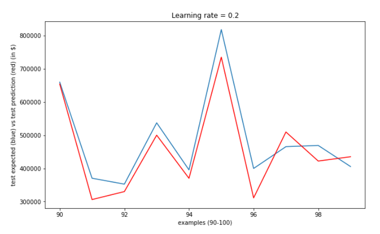
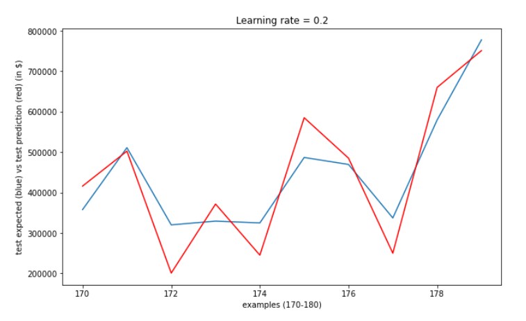
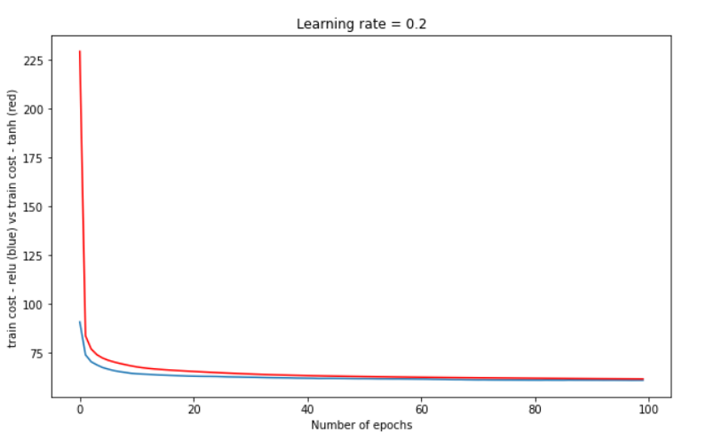
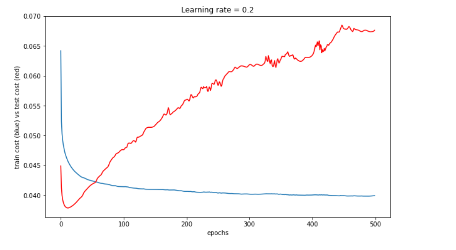

# Implementation of Neural Networks using C++

Using C++ and libraries like Eigen, a FeedForward Neural Network in Machine Learning is implemented. 
The neural network is trained on a Real estate data and it further makes predictions on the prices of Real estate.

## Plots

### Predictions on Test Data

Examples(90-100)       |  Examples(170-180)
:-------------------------:|:-------------------------:
  |  

Plotting the training cost on using <b>relu</b> and <b>tanh</b>   activation functions against number of epochs.

Plotting average train and cross validation costs against number of epochs using relu activation function.

## Dataset used

Kaggle dataset of House prices 
https://www.kaggle.com/c/house-prices-advanced-regression-techniques/data
